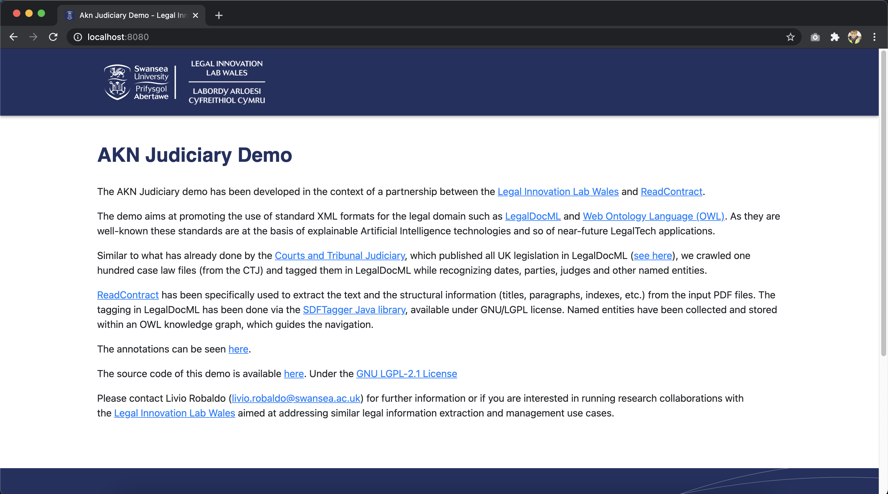
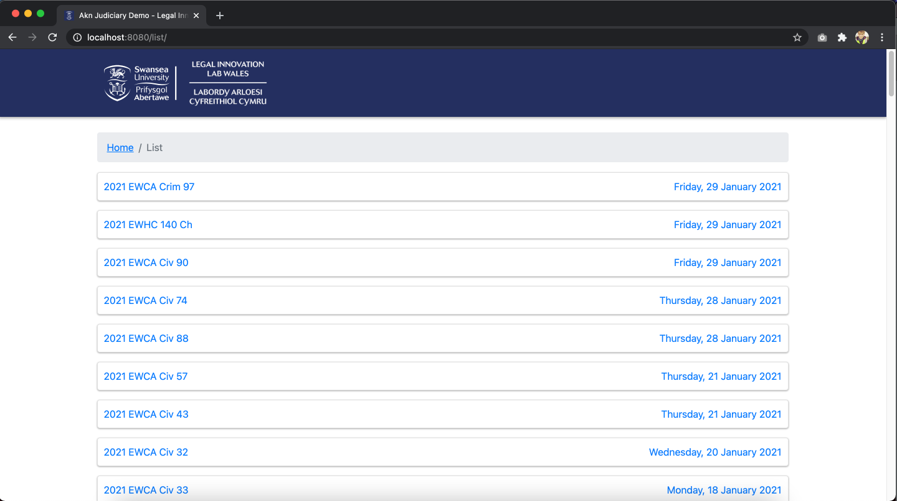
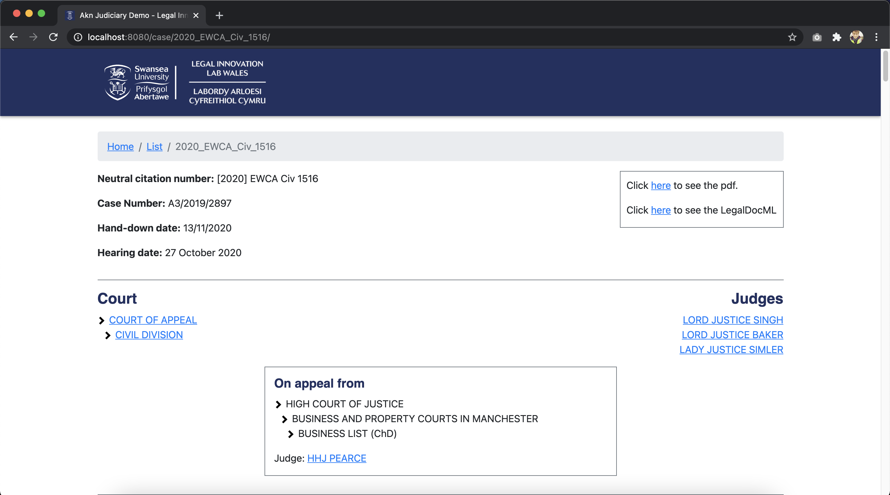

# Judiciary Akn Tagger

This repository contains the application code for the [Judiciary Akn Tagger (JAT)](https://akn-judiciary-demo.legaltech.wales). 
This application contains 101 case law files from [https://www.judiciary.uk](https://www.judiciary.uk) tagged in the 
[Akoma Ntoso XML standard](http://www.akomantoso.org/).

JAT is composed of a Java back-end and React front-end, the data-sources for this application come from a combination of
an Ontology Model, and the aforementioned XML files. The project structure is as outlined below

```txt
+-- src
|  +-- main
|      +-- java (back-end code)
|      +-- resources
|          +-- CORPUS (XML case law files)
|          +-- JudiciaryProcessorDEMOontology.owl (Ontology Model)
|      +-- ui (front-end code)
|          +-- README.md
|  +-- test (back-end unit tests)
+-- .gitignore
+-- gulpfile.js (Used to bundle the front-end build into resources)
+-- LICENSE
+-- package.json
+-- package-lock.json
+-- pom.xml (Maven build file)
+-- README.md
```
---
### Build

To build this project you will need to have [Maven](https://maven.apache.org/), [Java 11](https://adoptopenjdk.net/), 
[Node.js](https://nodejs.org/en/) and npm installed (npm should come bundled with Node.js), you will also need 
[gulp](https://gulpjs.com/) installed which can be done using ```npm install gulp --global```.
If you intend to make code changes to the applications front-end you will also require some
additional software packages to be installed, see the ```README``` file under ```src/main/ui``` for more information.

With the above installed you can now build the project ```mvn clean install``` and run the application server 
```java -jar target/judiciary-akn-tagger.jar``` you should now see the below output

```txt
2021.02.05 14:06:33 INFO io.helidon.common.LogConfig Thread[main,5,main]: Logging at initialization configured using classpath: /logging.properties
SLF4J: Failed to load class "org.slf4j.impl.StaticLoggerBinder".
SLF4J: Defaulting to no-operation (NOP) logger implementation
SLF4J: See http://www.slf4j.org/codes.html#StaticLoggerBinder for further details.
2021.02.05 14:06:33 INFO io.helidon.common.HelidonFeatures Thread[features-thread,5,main]: Helidon SE 2.2.0 features: [Config, WebServer]
2021.02.05 14:06:34 INFO io.helidon.webserver.NettyWebServer Thread[nioEventLoopGroup-2-1,10,main]: Channel '@default' started: [id: 0x5cb6c79c, L:/0:0:0:0:0:0:0:0:8080]
WEB server is up! http://localhost:8080
```
---
### Usage

To view the application visit ```http://localhost:8080``` in your browser, you will then reach the home page as seen 
below. 



From here you can visit the list page ```http://localhost:8080/list``` by clicking on the link in the line 
```The annotations can be seen here.``` as seen below.



You can then visit a case law files page, where the XML data is translated into a functional HTML markup via
a collection of React components by clicking on an item on the list page or by directly navigating to 
```http://localhost:8080/case/{id}``` where ```id``` is the name of the case laws XML file minus the file name suffix 
for example ```http://localhost:8080/case/2020_EWCA_Civ_1516``` as seen below.


